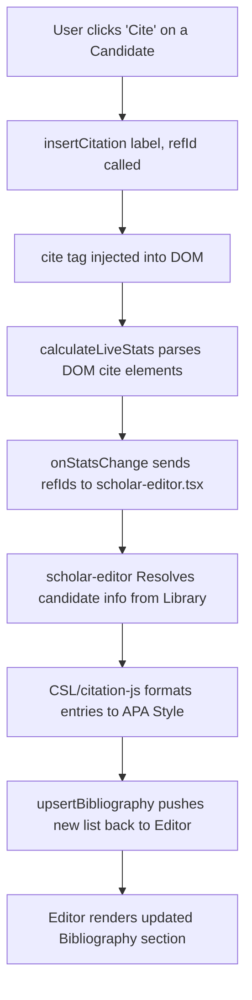

# ScholarFlow Editor & Citation Workflow

This document explains the technical details of the Editor.js integration, how inline citation markers are handled, and how the bibliography section is dynamically synchronized in real-time.

---

## 🏗️ 1. Editor.js Core Integration

The editor component is defined in [editorjs-editor.tsx](file:///c:/web/ScholarFlow/components/editor/editorjs-editor.tsx). It uses dynamic imports for Editor.js plugins to prevent server-side rendering (SSR) compile errors.

### Tools Configuration
- `header`: `@editorjs/header`
- `list`: `@editorjs/list`
- `image`: `@editorjs/image`
- `table`: `@editorjs/table`
- `code`: `@editorjs/code`
- `math`: A custom `MathBlockTool` class defined inside [editorjs-editor.tsx](file:///c:/web/ScholarFlow/components/editor/editorjs-editor.tsx#L8-L78). It inputs LaTeX strings, stores them in the block data, and renders the equation in real-time using `katex`.

### Exposed Methods
Using React's `useImperativeHandle`, the parent layout can control the editor instances:
- `undo()` / `redo()`: Managed via `editorjs-undo`.
- `setBlockType(type)`: Converts the active block between Paragraph and Headings (H1 to H6).
- `setBlockAlignment(align)`: Sets text alignment (`left`, `center`, `right`, `justify`) directly on the block wrapper and stores the state in localStorage (`scholarflow.editorjs.alignments.v1`) to persist on reload.
- `toggleInlineFormat(format)`: Implements standard text styling (bold, italic, etc.), including customized inline `<mark>` wrapping for highlights and inline `<code>` tags.
- `insertCitation(label, referenceId)`: Injects a `<cite>` tag at the cursor location (e.g. ` [Smith 2021]`).
- `upsertBibliography(entries)`: Updates the bibliography blocks at the bottom of the editor canvas.

### Programmatic Rendering & Save Protection
To prevent race conditions and data loss during document loading/refreshing:
- **`initialContent` Prop**: `EditorJsEditor` accepts an `initialContent` prop. If provided, the editor loads this content immediately on startup inside the `onReady` hook, preventing timing delays from asynchronous parent ref bindings.
- **`isRenderingRef` Lock**: Since programmatic rendering (such as `editor.render()`) triggers the `onChange` event in Editor.js, it could cause the system to save empty or incomplete content to the database during initialization. To avoid this, a mutable lock (`isRenderingRef`) is set to `true` during rendering. While `isRenderingRef.current` is `true`, any `onChange` events are ignored and not passed to `onContentChange`, ensuring the Supabase database is never overwritten with uninitialized data.

---

## 🔄 2. Real-Time Citation & Bibliography Loop

The dynamic citation-to-bibliography workflow operates as a continuous loop between the Editor.js component and the React state in `scholar-editor.tsx`:



### Step 1: Ingesting Citation into DOM
When a citation candidate is chosen, `onInsertCitationCandidate` is fired:
1. `insertCitation(candidate.citation_label, candidate.reference_id)` is invoked.
2. In the DOM, a custom `<cite>` element is injected at the selection range:
   ```html
   <cite data-citation="true" data-ref-id="10.1007/..." class="..."> [Smith 2021]</cite>
   ```

### Step 2: Live Stats Calculation & Reference ID Extraction
On every change/keyup/mouseup in the editor, `calculateLiveStats()` parses the editor container DOM:
1. It queries all elements: `cite[data-citation]`.
2. It compiles an array of active reference IDs:
   ```typescript
   const activeReferenceIds = Array.from(holder.querySelectorAll('cite[data-citation]'))
     .map(el => el.getAttribute('data-ref-id'))
     .filter(Boolean);
   ```
3. It dispatches these IDs up to the parent controller via `onStatsChange`.

### Step 3: Bibliography Formatting & Synchronization
Inside [scholar-editor.tsx](file:///c:/web/ScholarFlow/components/editor/scholar-editor.tsx):
1. The unique active reference IDs are mapped against the local `citationLibrary` dictionary cache.
2. The candidates are formatted into APA strings via `formatBibliographyCandidate` using `Cite` from `@citation-js/core`.
3. A `useEffect` hooks onto changes in `bibliographyEntries` and schedules an `upsertBibliography` call to the editor.
4. `upsertBibliography()` deletes the old bibliography blocks and inserts a fresh Heading and List block containing the formatted references.

---

## 🔎 3. Interactive Citation Details Modal & Cross-Lingual Matching

When a user clicks on an inline citation element in the editor, it triggers the detailed citation inspection overlay modal:

1. **Click Delegation Listener**: Inside [editorjs-editor.tsx](file:///c:/web/ScholarFlow/components/editor/editorjs-editor.tsx), a global click handler captures clicks targeting `<cite>` elements, extracts their reference ID, and extracts the preceding text node to capture the cited statement.
2. **AI Translation Matcher**:
   - If the cited statement is in Indonesian and the cited journal abstract is in English (or vice versa), a background `useEffect` in [scholar-editor.tsx](file:///c:/web/ScholarFlow/components/editor/scholar-editor.tsx) dispatches a translation request to the `/api/citations/translate` endpoint.
   - The endpoint utilizes Google Translate to translate the statement into the abstract's target language.
3. **Similarity Search**: The matching algorithm compares the (translated) claim against the abstract's sentences. The single sentence with the highest word-overlap is returned as the **Matching Snippet**.
4. **Rich Highlight Display**: The abstract section renders the abstract text, utilizing the custom `<HighlightedAbstract>` component to wrap the matched snippet in a soft indigo `<mark>` highlighting tag.

---

## 📄 4. Local PDF.js Sidebar Viewer & CORS Streaming Proxy

To display original PDF pages in the right-hand panel with precise phrase highlights:

1. **Background PDF URL Resolver**: When the modal loads, a background scraper triggers `/api/citations/resolve-pdf?url=[target_url]` to resolve webpages (like OJS article pages) to direct raw PDF files.
2. **CORS PDF Streamer**: The PDF is fetched via `/api/citations/view-pdf?url=[pdf_url]`. This proxy serves the binary stream with a CORS header (`Access-Control-Allow-Origin: *`) and replaces forced `attachment` dispositions with `inline`, rendering the PDF cleanly in the browser.
3. **Mozilla PDF.js Iframe**: Rather than native browser viewers (which split search queries by spaces and highlight random words), we load the PDF using a local pre-built distribution of Mozilla's PDF.js in `/public/pdfjs/web/viewer.html`.
4. **Exact Phrase Highlighting**: We pass the URL parameter `#search=[phrase]&phrase=true`. The `phrase=true` parameter forces PDF.js's underlying find controller to keep the search query intact as a single exact phrase, highlighting up to **25 words** of the target sentence in solid yellow and auto-scrolling directly to its coordinates.

